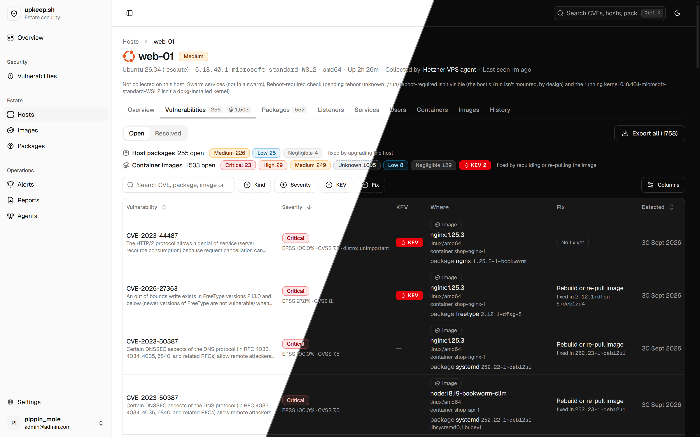

<div align="center">

# upkeep.sh

**Lightweight, self-hosted security monitoring for the servers you actually run.**

Know which packages to patch, which ports are really exposed, and which
container images are carrying known CVEs — ranked by what attackers are
exploiting, not by raw CVSS.

[](https://github.com/pippinmole/upkeep.sh/actions/workflows/ci.yml)
[](https://github.com/pippinmole/upkeep.sh/releases)
[](LICENSE)

[Getting started](#getting-started) ·
[How it works](#how-it-works) ·
[Agent security](#agent-security-model) ·
[Docs](#documentation) ·
[Roadmap](#roadmap)

</div>

<br>

<p align="center">
  
</p>

---

## Why upkeep.sh

Wazuh and Qualys are built for security teams. If you're a small developer
running a handful of VPSes on Hetzner, OVH or DigitalOcean, perhaps through
Dokploy or Coolify, you mostly need answers to a few questions:

- **What do I need to patch, and how urgently?** Installed packages are
  matched against OSV advisories using real dpkg version comparison, then
  ranked by [CISA KEV](https://www.cisa.gov/known-exploited-vulnerabilities-catalog)
  (actively exploited) and [FIRST EPSS](https://www.first.org/epss/)
  (predicted exploitation), with CVSS only as a tiebreaker.
- **What is actually exposed?** Listening sockets, combined with your ufw
  rules and Docker's published ports: *"port 5432 is published by Docker,
  and ufw doesn't apply to it."*
- **Did the patch actually take?** Pending reboots, and services still
  running old library versions after an upgrade.
- **What's in my containers?** Containers, images, networks and Swarm
  services per host, plus known vulnerabilities in the packages inside
  those images.
- **What's still open?** Alerts tell you when something changes. Weekly or
  monthly estate reports give you a patch list for every host, showing what
  changed since the last one, sent by email, webhook or
  [ntfy](https://ntfy.sh).

upkeep.sh does **not** patch anything for you, run remote commands,
produce compliance reports (SOC 2/CIS) or act as a SIEM. It reads, ranks
and tells you.

## Getting started

You run two things: the **platform** (dashboard, API, worker and Postgres),
once, and a small **agent** container on every host you want to monitor.
All images are published to GitHub Container Registry, signed, and ship
with an SBOM and build provenance ([docs/RELEASING.md](docs/RELEASING.md)).

| Image | What it is |
|---|---|
| `ghcr.io/pippinmole/upkeep-web` | Next.js dashboard and auth |
| `ghcr.io/pippinmole/upkeep-server` | Go API, background worker and database migrations |
| `ghcr.io/pippinmole/upkeep-agent` | Read-only host fact collector, a single static binary |

### 1. Run the platform

On the box that will host the dashboard, grab
[`deploy/docker-compose.yml`](deploy/docker-compose.yml) and
[`deploy/.env.example`](deploy/.env.example):

```sh
mkdir upkeep && cd upkeep
curl -fsSLO https://raw.githubusercontent.com/pippinmole/upkeep.sh/main/deploy/docker-compose.yml
curl -fsSL  https://raw.githubusercontent.com/pippinmole/upkeep.sh/main/deploy/.env.example -o .env
```

Fill in `.env`. Each required value says how to generate it:

| Variable | Value |
|---|---|
| `POSTGRES_PASSWORD` | `openssl rand -hex 24` |
| `BETTER_AUTH_SECRET` | `openssl rand -base64 32` |
| `SW_INTERNAL_RENDER_SECRET` | `openssl rand -base64 32` |
| `PUBLIC_WEB_URL` | Public HTTPS URL of the dashboard, e.g. `https://upkeep.example.com` |
| `PUBLIC_API_URL` | Public HTTPS URL agents report to, e.g. `https://api.upkeep.example.com` |

Then start it:

```sh
docker compose up -d
```

This starts Postgres, runs a one-shot `migrate` service, then `api`
(port 8080), `worker` and `web` (port 3000). Put a TLS-terminating reverse
proxy (Caddy, Traefik, or your Dokploy/Coolify domains) in front of those
two ports at `PUBLIC_WEB_URL` and `PUBLIC_API_URL`. To upgrade, set
`UPKEEP_VERSION` in `.env` and run `docker compose up -d` again.

> [!NOTE]
> The worker syncs vulnerability feeds (OSV, CISA KEV, EPSS) and scans
> container images. Give the box about 1 GB of RAM for it.

### 2. Create your account

Open `PUBLIC_WEB_URL` and sign up. Your account gets a workspace, and you
can invite teammates later from **Members**.

### 3. Add a host

In the dashboard, go to **Agents → Register agent**. It issues a one-time
enrollment token (valid for 1 hour) and gives you a ready-to-paste
command. It looks like this:

```sh
docker run -d --restart unless-stopped \
  --pid host --network host --read-only \
  --cap-drop ALL --security-opt no-new-privileges:true \
  --mount type=bind,src=/,dst=/host,readonly,bind-recursive=disabled \
  --mount type=bind,src=/var/lib/dpkg,dst=/host-extra/var/lib/dpkg,readonly \
  --mount type=bind,src=/var/lib/apt,dst=/host-extra/var/lib/apt,readonly \
  --mount type=bind,src=/run/systemd/system,dst=/host-extra/run/systemd/system,readonly \
  -v upkeep-agent-data:/var/lib/upkeep \
  -e SW_SERVER_URL=https://api.upkeep.example.com \
  -e SW_ENROLLMENT_TOKEN=<one-time-token-from-the-dashboard> \
  ghcr.io/pippinmole/upkeep-agent:0.1.1
```

To also inventory the host's Docker containers and images, add
`-v /var/run/docker.sock:/var/run/docker.sock` (read
[what that grants](#docker-collection-opt-in) first).

The dialog shows the host connecting live. After its first report, the
agent reports every 15 minutes (`SW_INTERVAL`).

<details>
<summary><strong>Prefer Compose, Dokploy or Coolify?</strong></summary>

<br>

Use [`agent/docker-compose.example.yml`](agent/docker-compose.example.yml).
Paste it into a Dokploy/Coolify compose app (or run it with
`docker compose up -d`), then set `SW_SERVER_URL` and `SW_ENROLLMENT_TOKEN`.
The agent needs no inbound ports.

</details>

<details>
<summary><strong>Docker CLI older than 25?</strong></summary>

<br>

The docker 24 CLI rejects `bind-recursive=disabled` ("unexpected key") and
spells it `bind-nonrecursive=true` instead. Docker CLI 25 and later reject
that spelling in turn. The engine has honoured non-recursive binds since 19.03.
Compose needs a version that supports `bind: recursive: disabled`
(tested with Compose v5.5.1).

</details>

<details>
<summary><strong>Hosts without their own agent</strong></summary>

<br>

An existing agent can also read other hosts over SSH: choose **Add host →
Reach it from an existing agent**. Those hosts are read over SFTP, so they
report packages and vulnerabilities, but no Docker inventory, listening
ports, port exposure, restart-needed processes or public IP.

</details>

## How it works

```
 your hosts                                  your platform box
┌───────────────────────┐   HTTPS, outbound   ┌───────────────────────────────┐
│ upkeep-agent          │ ──────────────────▶ │ api     enroll + ingest       │
│  packages (dpkg)      │    facts only       │ worker  OSV / KEV / EPSS sync │
│  listening sockets    │                     │         matching, alerts,     │
│  ufw + Docker ports   │                     │         image scans, reports  │
│  reboot / restarts    │                     │ web     dashboard (Next.js)   │
│  containers, images   │                     │ postgres                      │
└───────────────────────┘                     └───────────────────────────────┘
```

- **agent/** (Go): a single static binary that collects read-only facts and
  pushes them outbound. It opens no ports and has no remote command
  execution.
- **server/** (Go): agent enrollment and ingest (`api`); feed sync,
  vulnerability matching, exposure analysis, image scanning, alerting and
  reports (`worker`); and the SQL migrations (`migrate`).
- **web/** (Next.js, Bun, Better Auth): the dashboard. It reads Postgres
  directly ([why](docs/decisions/direct-postgres-reads.md)).

Currently supported: Debian and Ubuntu hosts (x86-64 and arm64), with Docker
or Podman for container inventory. RHEL and Alpine collectors are on the
roadmap. Windows and macOS are not planned for now.

## Agent security model

The agent is the part of upkeep.sh that runs on machines you care about, so
it's deliberately boring:

- **Outbound only, read only.** It runs with no inbound ports, a read-only
  root filesystem, `cap_drop: ALL` and `no-new-privileges`, and it never
  executes commands sent by the server.
- **No host sockets.** The host's `/` is bound at `/host`
  *non-recursively*. A plain `-v /:/host:ro` would also carry the `/run`
  tmpfs with `docker.sock`, containerd, D-Bus and systemd's socket, and
  `:ro` doesn't stop `connect()`, so that mount alone would be root on the
  host. The few directories it needs from other mounts are bound one by
  one under `/host-extra`. Please don't "simplify" the mounts.
- **It checks itself.** If any host socket is reachable under `/host`, the
  agent logs a `WARN:` at startup and reports the `host_mount` collector as
  an error on the host page. To check by hand (exit code 1 if a socket is
  reachable):

  ```sh
  docker compose run --rm upkeep-agent check-mounts
  ```

  CI runs the same check against the compose example.
- **Pinned, signed releases.** Images are built only in CI from a `vX.Y.Z`
  tag on `main`, then signed and attested. Install commands pin an exact
  version, never `:latest`, so a bad release can't reach your hosts on its
  own.

### Docker collection (opt-in)

With the Docker socket mounted, the agent inventories containers, images,
networks and Swarm services, and the server scans those images for
vulnerable packages. **Access to the Docker socket is root-equivalent on
the host.** A socket has no read-only mode, and `:ro` doesn't limit it.

The agent only makes read calls: ping, version, info, container
list/inspect, image list/inspect, network list, and on Swarm managers
service/task/node list. It never calls logs, exec, file export, secrets or
configs, never changes state, and never sends environment variables. See
[docs/decisions/docker-collection.md](docs/decisions/docker-collection.md).

Mount the socket your engine uses at `/var/run/docker.sock` in the
container (or set `SW_DOCKER_SOCKET`):

| Engine | Host socket |
|---|---|
| Docker | `/var/run/docker.sock` |
| Rootless Docker | `$XDG_RUNTIME_DIR/docker.sock`, e.g. `/run/user/1000/docker.sock` |
| Podman (rootful) | `/run/podman/podman.sock` after `systemctl enable --now podman.socket` |
| Podman (rootless) | `$XDG_RUNTIME_DIR/podman/podman.sock` after `systemctl --user enable --now podman.socket` |

If the socket belongs to another user (for example, a rootless socket
while the agent runs under a rootful engine), add its group id
(`stat -c %g <socket>`) with `--group-add` or Compose's `group_add`.

## Configuration

- **Platform:** every setting is documented inline in
  [`deploy/.env.example`](deploy/.env.example) and
  [`deploy/docker-compose.yml`](deploy/docker-compose.yml).
- **Agent:** `SW_SERVER_URL`, `SW_ENROLLMENT_TOKEN` (first run only),
  `SW_INTERVAL` (default `15m`), `SW_DOCKER_SOCKET` and `SW_SSH_KEY_FILE`.
  The `upkeep-agent-data` volume holds the agent's credentials and SSH key.
  Keep it across upgrades, or the agent will need to enroll again.
- **Mirroring images:** set `SW_AGENT_IMAGE` on the `web` container, and
  the dashboard's install command uses your registry.
- **Alerts and reports:** channels (email over SMTP, webhooks, ntfy) are set
  up in the dashboard. See [docs/ALERTING.md](docs/ALERTING.md) and
  [docs/WEBHOOKS.md](docs/WEBHOOKS.md).

## Development

```sh
git clone https://github.com/pippinmole/upkeep.sh
cd upkeep.sh
docker compose -f docker-compose.dev.yml up --build
```

This starts Postgres, runs the migrations, then the Go API on `:8080` and
the Next.js app on `:3000`. You don't need to set anything up: the dev
credentials are hardcoded in that file on purpose. To run `bun dev` outside
Docker, copy `web/.env.example` to `web/.env.local`.

To build the production stack from source instead of pulling images, use the
root [`docker-compose.yml`](docker-compose.yml) with `.env.example`.

```
agent/     Go host agent (collectors, enrollment, check-mounts)
server/    Go api, worker and migrate; server/migrations/ is the schema contract
web/       Next.js dashboard (App Router, Bun, Better Auth, shadcn/ui)
deploy/    Compose + env for running the published images
docs/      Architecture, protocol, decision log, task tracker
```

## Documentation

- [Architecture](docs/ARCHITECTURE.md): components, data flow and
  deployment shapes.
- [Protocol](docs/PROTOCOL.md): the agent↔server wire format, auth and
  versioning.
- [Domain model](docs/DOMAIN_MODEL.md): agents, hosts, snapshots and
  findings.
- [Decisions](docs/decisions/README.md): why things are built the way they
  are.
- [Releasing](docs/RELEASING.md): how images are built, signed and pinned.

## Roadmap

upkeep.sh is **early and pre-1.0**. It works end to end and runs on real
servers, but expect rough edges and schema changes between minor versions.
[docs/tasks/](docs/tasks/README.md) is the detailed, always-current
tracker.

- [x] Agent collectors, enrollment, ingest
- [x] OSV Debian/Ubuntu matching with dpkg version semantics, KEV + EPSS
      ranking
- [x] Findings dashboard, CSV export
- [x] Alerts over email, webhook and ntfy, with dedup and digests
- [x] Scheduled weekly/monthly estate reports
- [x] Workspaces, members and roles
- [ ] Docker inventory and host-side port exposure (in progress)
- [ ] Container image vulnerabilities (in progress)
- [ ] RHEL and Alpine collectors
- [ ] Slack and Discord notifiers
- [ ] External port-exposure scanning

## Contributing

Issues and pull requests are welcome. Before you start on something
non-trivial, check [docs/tasks/](docs/tasks/README.md) to see whether it's
planned, and read [docs/decisions/](docs/decisions/README.md) before
reopening a settled design choice. It's often faster to open an issue
first.

## Security

If you've found a vulnerability in upkeep.sh, especially in the agent,
please **don't open a public issue**. Report it privately through
[GitHub security advisories](https://github.com/pippinmole/upkeep.sh/security/advisories/new).

## License

[MIT](LICENSE) © Jonathan Ruffles
